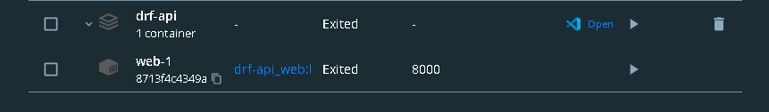
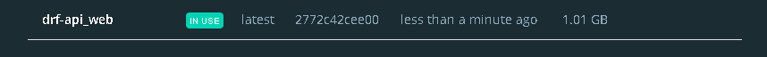

# drf-api

> run server `python manage.py runserver` or use the docker command `docker compose up`

> home page `http://localhost:8000/api/v1/car_info/`

> Example Detail page example
>> Path url `http://localhost:8000/api/v1/car_info/2/`

> admin panel `http://localhost:8000/admin/`
>> For admin panel use ( user name `admin` , password `admin` ) 

> testing `python manage.py test`

> Docker screenshots 
- docker container

- docker image

